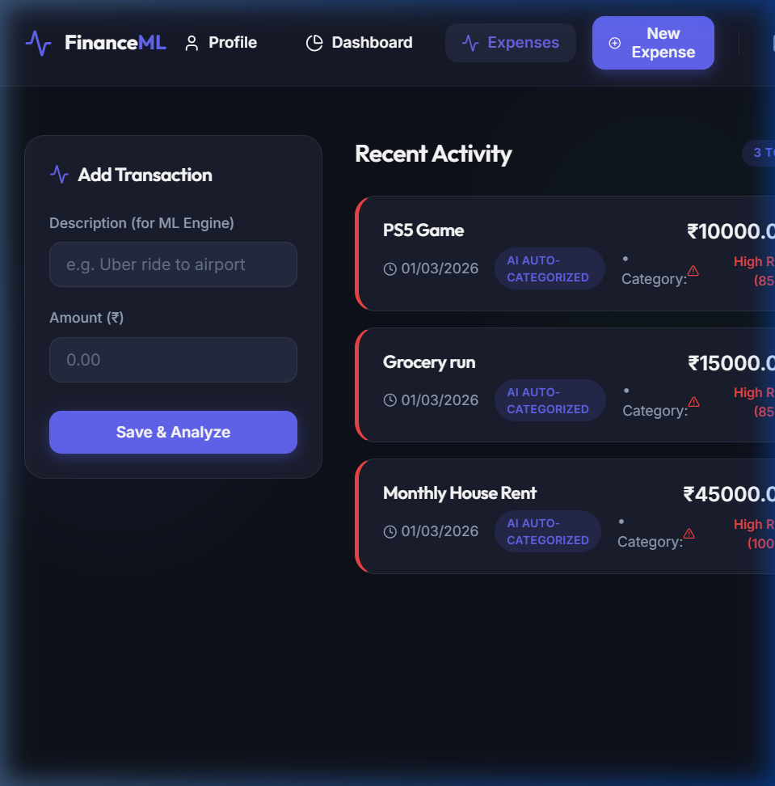
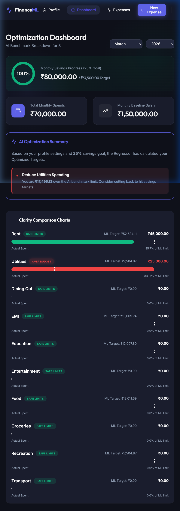

# Personal Finance ML: Autonomous Optimizer 🚀

An end-to-end Machine Learning-powered Personal Finance application. This platform automatically categorizes transactions, detects anomalous spending behavior, and actively generates optimized target budgets based on your demographic profile (Salary, City Tier, Savings Goal).

## 🌟 Key Features

*   **Autonomous Categorization (Random Forest):** 
    Uses NLP Text-Vectorization to instantly read expense descriptions (e.g., "Uber ride") and infer the correct category.
*   **Anomaly Detection (Isolation Forest):** 
    Flags dangerous or irrational spending based on your historical mathematical distributions, grading anomalies from 0-100% Risk.
*   **Clarity Dashboard & AI Coaching:**
    A beautifully engineered React Dashboard. Blue actuals intersect visually with Dotted-Line ML limits. If you overspend, it dynamically generates an "AI Coaching Plan" pinpointing where to cut costs.
*   **Theme Engine:**
    A sleek, premium Dark & Light mode design system using pure CSS variables and Lucide Icons.

---

## 📸 Visual Tour

### The Clarity Dashboard & AI Coaching


### Live Transaction Categorization


### Monthly PDF Reports


---

## 🛠️ Architecture

*   **Django 6.0 & DRF (Backend):** The core API routing and logic.
*   **Scikit-Learn (ML Engine):** Joblib artifacts load into memory. `RandomForestRegressor` sets demographic budgets, `IsolationForest` monitors for anomalies.
*   **React + Vite (Frontend):** Blazing fast interactive SPA consumed exclusively via secure JWTs. 
*   **Swagger API Docs (`drf-spectacular`):** Professionally annotated OpenAPI schematics. See exactly what the ML engine needs under `/api/docs/`.

---

## 🚀 Quick Start & Installation

**Prerequisites:** Python 3.10+ and Node.js 18+

### 1. Setup the Backend Environment
```bash
cd personal-finance-ml
python -m venv .venv
# Activate: source .venv/bin/activate (Mac/Linux) OR .venv\Scripts\activate (Windows)
pip install -r requirements.txt

# Migrate and build DB
python manage.py makemigrations
python manage.py migrate

# 🌟 Instantiate the ML Context Demo Profiles!
python manage.py seed_demo_data

# Start Server
python manage.py runserver
```

### 2. Setup the Frontend Client
```bash
# Open a second terminal
cd personal-finance-ml/frontend
npm install
npm run dev
```
Navigate to **`http://localhost:5173`** 🌍

### 3. Demo Mode Login
The `seed_demo_data` command generates pre-populated profiles with a month of dummy expenses so you can instantly see the ML visuals working:

*   **Tony Stark (Tier 1 Metro, ₹5,00,000 Salary)**
    *   Username: `tony_stark`
    *   Password: `demo123`
*   **Standard Profile (Tier 2, ₹60,000 Salary)**
    *   Username: `normal_user`
    *   Password: `demo123`

---

## 🧠 Behind the ML

The `/ml_engine/` handles offline training and live inference. 

1. `generate_training_data.py`: Built 15,000 extreme-range synthetic records based on highly specific mathematical rules depending on the Indian demography (Tier 1 vs Tier 3 rental markets).
2. `train.py`: Compiles the `TfidfVectorizer` mapping arrays and exports `.joblib` binary artifacts.
3. `services.py`: The live connection. When Django hits `ExpenseViewSet.perform_create()`, it securely fires the transaction to `detect_anomaly()` mapping risk scores linearly before writing to Postgres/SQLite.
